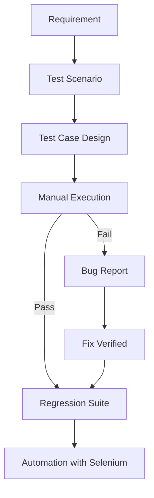

<div align="center">


<br/>


<br/><br/>

<a href="https://github.com/Jothirupan26">

</a>
<a href="YOUR_LINKEDIN_URL">

</a>
<a href="mailto:YOUR_EMAIL@example.com">

</a>

<br/>


</div>

<br/>

## 🧑‍💻 About Me

I'm a **QA Engineer** who bridges manual precision with automation efficiency. I don't just check whether something works — I dig into *how* and *why* it might break, then build repeatable automated checks so it never breaks silently again.

```yaml
role: QA Engineer
focus: [Manual Testing, Selenium Automation]
stack: Java + Selenium WebDriver + TestNG + Maven
mindset: "Think like a user. Test like a machine. Investigate like a developer."
currently_exploring: Framework architecture & CI-integrated test suites
```

<br/>

## 🧪 Core Skills

<table>
<tr>
<td valign="top" width="50%">

**Manual Testing**
- Functional & Regression Testing
- Test Case & Scenario Design
- UI / Exploratory Testing
- Bug Identification & Reporting
- Requirement Analysis

</td>
<td valign="top" width="50%">

**Automation Testing**
- Selenium WebDriver (Java)
- TestNG (Assertions, DataProviders, Listeners)
- Maven build & dependency management
- XPath / CSS Locator strategy
- Screenshot capture & test reporting

</td>
</tr>
</table>

<div align="center">


</div>

<br/>

## 🚀 Featured Projects

### 🏦 ParaBank Automation Suite
**Selenium · Java · TestNG · Maven · Extent Reports**

End-to-end automated testing of core banking workflows — login, account management, fund transfers, and bill payments — built on a modular Page Object Model framework.

```
src/
├── main/java/
│   ├── base/         → Driver setup & base test class
│   ├── pages/         → Page Object Model classes
│   ├── utils/         → Reusable helper methods
│   └── listeners/     → TestNG listeners & reporting hooks
├── test/java/
│   ├── tests/         → Test scripts
│   └── dataproviders/ → Data-driven test inputs
└── resources/
    ├── config.properties
    └── testdata/
```

**Modules covered:** Login → Account Management → Fund Transfer → Bill Payment

🔗 [**View Repository**](https://github.com/Jothirupan26)

---

### 🌐 E-Commerce Web Automation
**Selenium · Java · TestNG · Maven**

A regression-ready suite covering the full shopping journey: login, registration, product search, cart operations, checkout, and UI validation.

`Login` `Registration` `Product Search` `Cart` `Checkout` `UI Validation` `Regression`

🔗 [**View Repository**](https://github.com/Jothirupan26)

<br/>

## 🔬 My Testing Workflow



<br/>

## 📈 Current Focus

| Skill | Progress |
|---|---|
| Manual Testing | ████████████████████ 95% |
| Selenium Automation | ██████████████████░░ 90% |
| Java | █████████████████░░░ 80% |
| TestNG | █████████████████░░░ 80% |
| SQL | ███████████████░░░░░ 70% |
| Framework Architecture | ██████████████░░░░░░ 65% |

<br/>

## 📊 GitHub Stats

<div align="center">


</div>

<br/>

## 🎯 Open To

**QA Engineer** · **Manual Tester** · **Automation Tester (SDET track)**

`Selenium` `Java` `TestNG` `Maven` `SQL` `Manual Testing` `Test Automation`

<br/>

<div align="center">

> ### "Don't just verify that it works — find out how it breaks."

<br/>


**Thanks for stopping by — let's connect! 👋**

</div>
