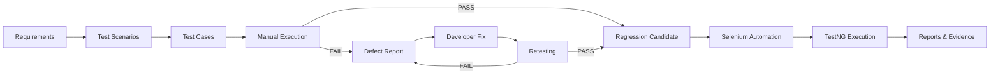

<div align="center">

<!-- HERO -->


<br>

<a href="https://github.com/Jothirupan26">
  
</a>
<a href="https://www.linkedin.com/in/jothirupan-d-761926366/">
  
</a>
<a href="mailto:jothirupand@gmail.com">
  
</a>

<br><br>


<br>


</div>

---

## 🧪 `whoami`

> **QA Engineer focused on Manual & Automation Testing**

I approach quality from two sides:

**Human thinking** for understanding requirements, exploring applications, identifying edge cases and reporting defects.

**Automation thinking** for turning repeatable, high-value scenarios into maintainable Selenium test suites.

My current automation stack is built around **Java, Selenium WebDriver, TestNG and Maven**, with a focus on clean test structure, reusable utilities and meaningful reporting.

```text
┌─────────────────────────────────────────────────────────────┐
│                       QA MINDSET                            │
├─────────────────────────────────────────────────────────────┤
│  Understand  →  Design  →  Execute  →  Investigate         │
│       ↓             ↓           ↓            ↓              │
│  Requirements   Test Cases   Automation   Defect Analysis  │
│       └─────────────────────────────────────────────┘       │
│                          ↓                                  │
│                    Quality Confidence                       │
└─────────────────────────────────────────────────────────────┘
```

### 🎯 My Testing Philosophy

```text
Think like a user.
Test like an engineer.
Investigate like a developer.
Automate what matters.
```

---

## 🛠️ Tech Arsenal

<div align="center">

### Testing


### Automation


### Programming & Data


### Tools


</div>

---

## 🔬 What I Do

<table>
<tr>
<td width="33%" valign="top">

### 🔍 Manual QA

* Requirement analysis
* Test scenarios
* Test case design
* Functional testing
* Regression testing
* Exploratory testing
* UI validation
* Defect identification
* Bug reporting

</td>

<td width="33%" valign="top">

### 🤖 Automation

* Selenium WebDriver
* Java automation
* TestNG
* XPath & CSS locators
* Assertions
* Data-driven testing
* Listeners
* Screenshots
* Reusable utilities

</td>

<td width="33%" valign="top">

### 🧰 QA Engineering

* Maven projects
* Page Object Model
* Test execution
* Test reporting
* Framework organization
* Git version control
* Defect lifecycle
* Regression suites

</td>
</tr>
</table>

---

# 🚀 Featured Projects

## 🏦 ParaBank Automation Framework

**A structured Selenium automation framework for banking workflows.**

<a href="https://github.com/Jothirupan26/Para_Bank">

</a>

<br><br>

| Area              | Coverage                  |
| ----------------- | ------------------------- |
| 🔐 Authentication | Login validation          |
| 🏦 Accounts       | Account-related workflows |
| 💸 Transfers      | Fund transfer scenarios   |
| 🧾 Payments       | Bill payment scenarios    |
| 📸 Evidence       | Failure screenshots       |
| 📊 Reporting      | Extent Reports            |
| 🧱 Architecture   | Page Object Model         |
| 🧪 Framework      | Selenium + TestNG + Maven |

### Architecture

```text
ParaBank Automation
│
├── src/main/java
│   ├── base
│   │   └── Driver & browser setup
│   │
│   ├── pages
│   │   └── Page Objects
│   │
│   ├── utils
│   │   └── Reusable utilities
│   │
│   └── listeners
│       └── Test execution listeners
│
├── src/test/java
│   ├── tests
│   └── dataproviders
│
├── src/test/resources
│   ├── config.properties
│   ├── testdata
│   └── testng.xml
│
└── Reports
    ├── Extent Reports
    └── Failure Screenshots
```

---

## 🛒 E-Commerce Automation Suite

**Web UI automation focused on realistic customer journeys and regression scenarios.**

<a href="https://github.com/Jothirupan26/Selenium_Project_ECA">

</a>

<br><br>

```text
USER JOURNEY

Registration
     ↓
   Login
     ↓
 Product Search
     ↓
 Product Validation
     ↓
    Cart
     ↓
  Checkout
     ↓
 Regression Validation
```

**Coverage includes:**

`Registration` · `Login` · `Search` · `Product Validation` · `Cart` · `Checkout` · `Regression`

---

# 🧠 My QA Workflow


```mermaid
flowchart LR
    A[Requirements] --> B[Test Scenarios]
    B --> C[Test Cases]
    C --> D[Manual Execution]

    D -->|PASS| E[Regression Candidate]
    D -->|FAIL| F[Defect Report]

    F --> G[Developer Fix]
    G --> H[Retesting]

    H -->|PASS| E
    H -->|FAIL| F

    E --> I[Selenium Automation]
    I --> J[TestNG Execution]
    J --> K[Reports & Evidence]
```

---

# 🔄 From Bug to Automation

<div align="center">

```text
      🧠 UNDERSTAND
           │
           ▼
      📋 DESIGN TEST
           │
           ▼
      🔍 EXECUTE
        ┌──┴──┐
        │     │
      PASS   FAIL
        │     │
        │     ▼
        │   🐛 REPORT
        │     │
        │     ▼
        │   🔧 FIX
        │     │
        └─────┤
              ▼
        🔁 REGRESSION
              │
              ▼
        🤖 AUTOMATE
              │
              ▼
        📊 REPORT
              │
              ▼
        ✅ CONFIDENCE
```

</div>

---

# 📈 Current Learning Path

```text
                    QA ENGINEERING
                         │
          ┌──────────────┴──────────────┐
          │                             │
      MANUAL QA                    AUTOMATION
          │                             │
   ┌──────┼──────┐              ┌───────┼───────┐
   │      │      │              │       │       │
Test   Bug    Regression     Selenium  Java   TestNG
Cases  Report    Testing         │       │       │
   │      │                      └───────┼───────┘
   │      │                              │
   └──────┴──────────────┬───────────────┘
                          │
                          ▼
                 FRAMEWORK DESIGN
                          │
                          ▼
                    CI / CD NEXT
```

### Currently Exploring

* 🧱 Better automation framework architecture
* 🔄 CI-integrated test execution
* 📊 Advanced reporting
* 🧪 Scalable regression suites
* 🗄️ Stronger SQL validation
* ⚙️ Improving automation maintainability

---

# 📊 GitHub Activity

<div align="center">


<br><br>


<br><br>


</div>

---

# 🎯 Career Focus

<div align="center">

### QA Engineer · Manual Tester · Automation Tester

<br>


<br><br>

**Turning requirements into test cases,
test cases into automation,
and defects into better software.**

</div>

---

## 📫 Connect

<div align="center">

<a href="https://www.linkedin.com/in/jothirupan-d-761926366/">

</a>

<a href="mailto:jothirupand@gmail.com">

</a>

<a href="https://github.com/Jothirupan26">

</a>

</div>

<br>

<div align="center">

### `Quality isn't just finding bugs.`

### `It's building confidence in every release.`

<br>


</div>

