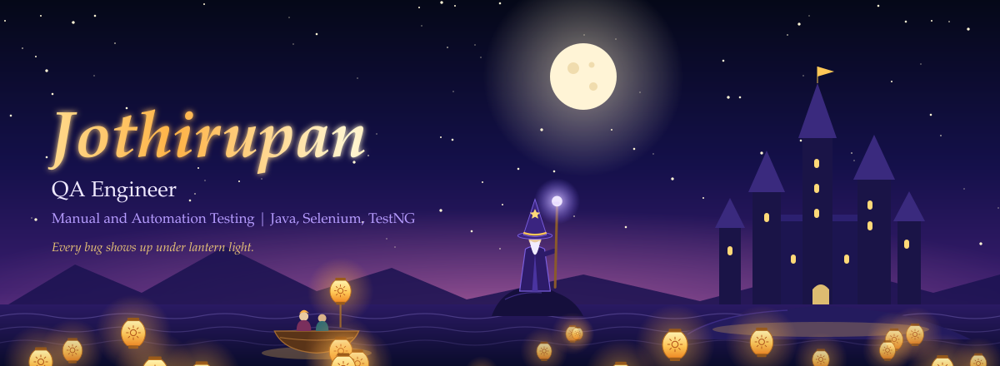
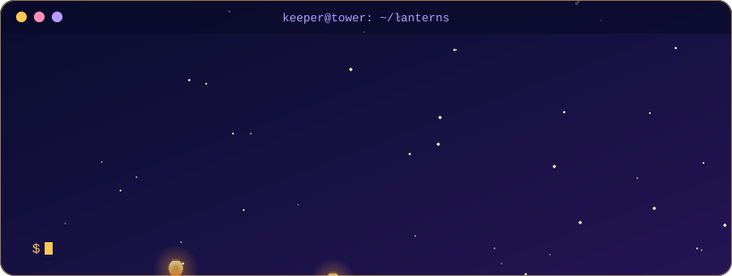
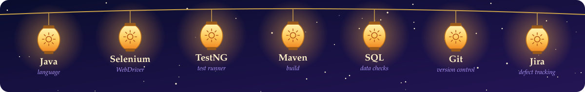
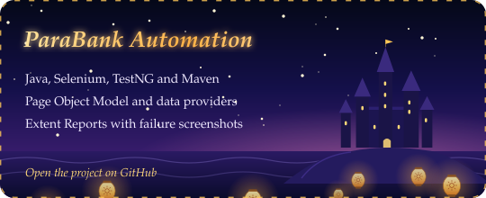
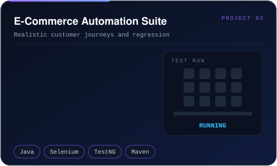
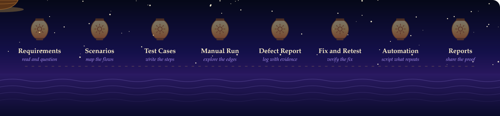
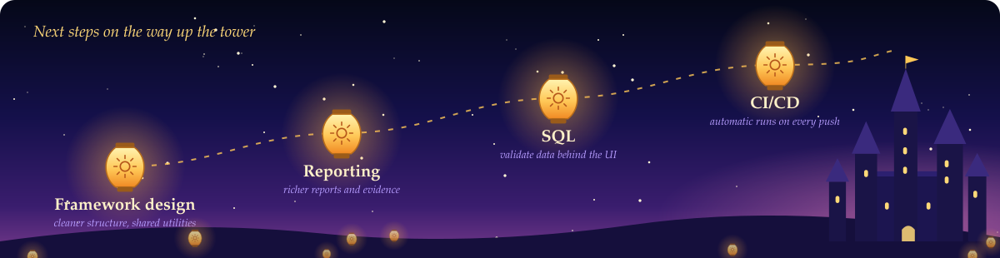

   

 

  

  

 
 
🏰 whoami

  
  

QA Engineer focused on Manual and Automation Testing. I approach quality from two sides: human thinking to understand requirements, explore applications, find edge cases and report defects, and automation thinking to turn repeatable, high-value scenarios into maintainable Java + Selenium + TestNG + Maven suites with clean structure, reusable utilities and meaningful reporting.

text
Think like a user.
Test like an engineer.
Investigate like a developer.
Automate what matters.

 
🏮 Tech Arsenal

             
   <table> <tr> <td width="33%" valign="top">
🔍 Manual QA
Requirement analysis
Test scenarios and test cases
Functional testing
Regression testing
Exploratory testing
UI validation
Defect identification and reporting
</td> <td width="33%" valign="top">
🤖 Automation
Selenium WebDriver with Java
TestNG, assertions, listeners
XPath and CSS locators
Data-driven testing
Failure screenshots
Reusable utilities
</td> <td width="33%" valign="top">
🧰 QA Engineering
Maven projects
Page Object Model
Test execution and reporting
Framework organization
Git version control
Defect lifecycle
Regression suites
</td> </tr> </table> 
🏰 Featured Projects

 <table> <tr> <td align="center">  </td> <td align="center">  </td> </tr> </table> 
 
 
<b>🧱 ParaBank framework architecture (open the castle gates)</b>

text
ParaBank Automation
│
├── src/main/java
│   ├── base         → driver and browser setup
│   ├── pages        → page objects
│   ├── utils        → reusable utilities
│   └── listeners    → test execution listeners
│
├── src/test/java
│   ├── tests
│   └── dataproviders
│
├── src/test/resources
│   ├── config.properties
│   ├── testdata
│   └── testng.xml
│
└── Reports
    ├── Extent Reports
    └── Failure Screenshots

 
 
<b>🛒 E-Commerce user journey (the market by the river)</b>

text
Registration → Login → Product Search → Product Validation → Cart → Checkout → Regression Validation

 
⛵ My QA Workflow

  
 
 
<b>🐛 Defect lifecycle (where the wizard's bugs get caught)</b>

PASS
FAIL
PASS
FAIL
Requirements
Test Scenarios
Test Cases
Manual Execution
Regression Candidate
Defect Report
Developer Fix
Retesting
Selenium Automation
TestNG Execution
Reports and Evidence

 
🗼 Learning Path

  
 
✨ GitHub Activity

     

  

<picture> <source media="(prefers-color-scheme: dark)" srcset="https://raw.githubusercontent.com/Jothirupan26/Jothirupan26/output/github-snake-dark.svg"/> <source media="(prefers-color-scheme: light)" srcset="https://raw.githubusercontent.com/Jothirupan26/Jothirupan26/output/github-snake.svg"/>  </picture> 
 
📫 Send a Lantern

  

 
